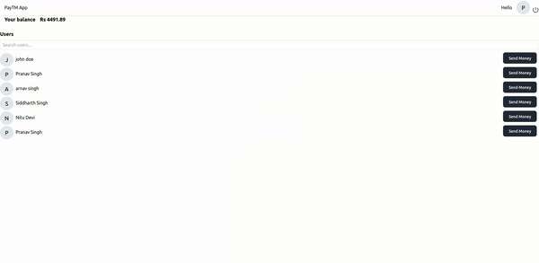

# Paytm-simple Application

Paytm-simple is a simple virtual wallet application that allows users to sign up, sign in, and perform transactions with virtual money. Users can send money to other registered users through the dashboard.

## Features

- **User Authentication**: Users can sign up and sign in securely to access their accounts.
- **Virtual Wallet**: Upon signing in, users are given virtual money which they can use for transactions.
- **Dashboard**: Users can view their balance and transaction history through the dashboard.
- **Send Money**: Users can send virtual money to other registered users of the application.

## Getting Started

To get started with Paytm, follow these steps:

1. **Clone this Repository**

   ```sh
   git clone https://github.com/100xdevs-cohort-2/paytm
   cd paytm
   ```

2. **Setup MongoDB**

   You can either create a free MongoDB cluster on [MongoDB Atlas](https://www.mongodb.com/) or run MongoDB locally using Docker.

   - **Using MongoDB Atlas:**

     Sign up for a free MongoDB Atlas account and create a new cluster. Once the cluster is created, obtain the connection string.

   - **Using Docker:**

     Ensure Docker is installed on your machine, then run the following command to start a MongoDB container:

     ```sh
     docker run --name mongo -d -p 27017:27017 mongo
     ```

3. **Configure Environment Variables**

   Create a `.env` file in the root directory and add the MongoDB connection string:

   ```sh
   MONGO_URL=your_mongodb_connection_string
   ```

4. **Install Dependencies**

   ```sh
   npm install
   ```

5. **Run the Application**

   - **Backend**: Navigate to the backend folder and start the server.

     ```sh
     cd backend
     node index.js
     ```

   - **Frontend**: Navigate to the frontend folder and start the server.

     ```sh
     cd frontend
     npm run dev
     ```

6. **Access the Application**

   Access the application through the link generated after starting the frontend server.


## Technologies Used

### Backend

- **Node.js**: Backend server environment.
- **Express.js**: Web framework for Node.js.
- **Mongoose**: An ODM (Object Data Modeling) library for MongoDB and Node.js.
- **Zod**: A TypeScript-first schema declaration and validation library.
- **MongoDB**: A NoSQL, beginner friendly, scalable database.

### Frontend

- **React**: A JavaScript library for building user interfaces.
- **Tailwind CSS**: A utility-first CSS framework for rapid UI development.
- **JavaScript**: Client-side scripting for dynamic functionality.

## Acknowledgements

Special thanks to the developers of Node.js, Express.js, MongoDB, and other open-source technologies used in this project, and especially to Harkirat Singh and his 100xDevs cohort 2.0.

## License

This project is licensed under the MIT License.

## Preview

[Paytm-simple Preview](https://youtu.be/JQ8rFbFF6PM)


## Paytm-simple

 
